# コツァ'sブログアプリ

1.概要 
このアプリは記事を投稿、閲覧することができるブログアプリです。 
特に技術系の記事に向いていますがいろんなジャンルの記事を投稿することができます。 

2.開発の背景・経緯 
このアプリを開発しようと考えたきっかけは自分が普段記事を読んだりwebサービスを理由するなかで感じた不満を解決しようと考えたからです。 
詳しくは後の機能紹介や工夫点で書きますが、目安箱や記事の要約など私が普段から欲しいと考えていた機能を今回のアプリでは実装しました。 

3.公開URL 
<a href="https://next-blog-app-lake.vercel.app">https://next-blog-app-lake.vercel.app</a> 

## 特徴と機能の説明

### 1.各ページについての説明 
- 閲覧用記事一覧ページ 
このページでは投稿記事が一覧で確認できます。 
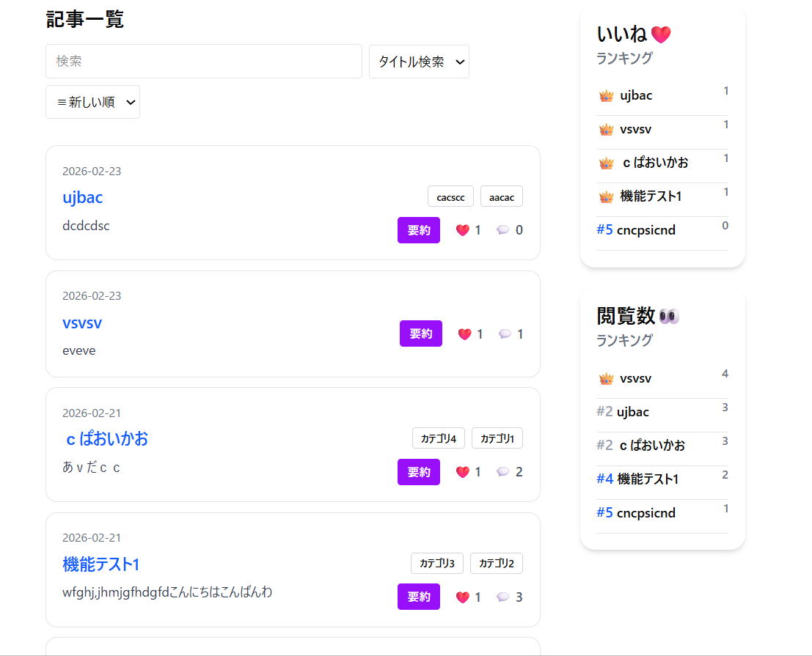 

- 記事詳細ページ 
このページでは記事の本文及び内容を楽しむことができます。 
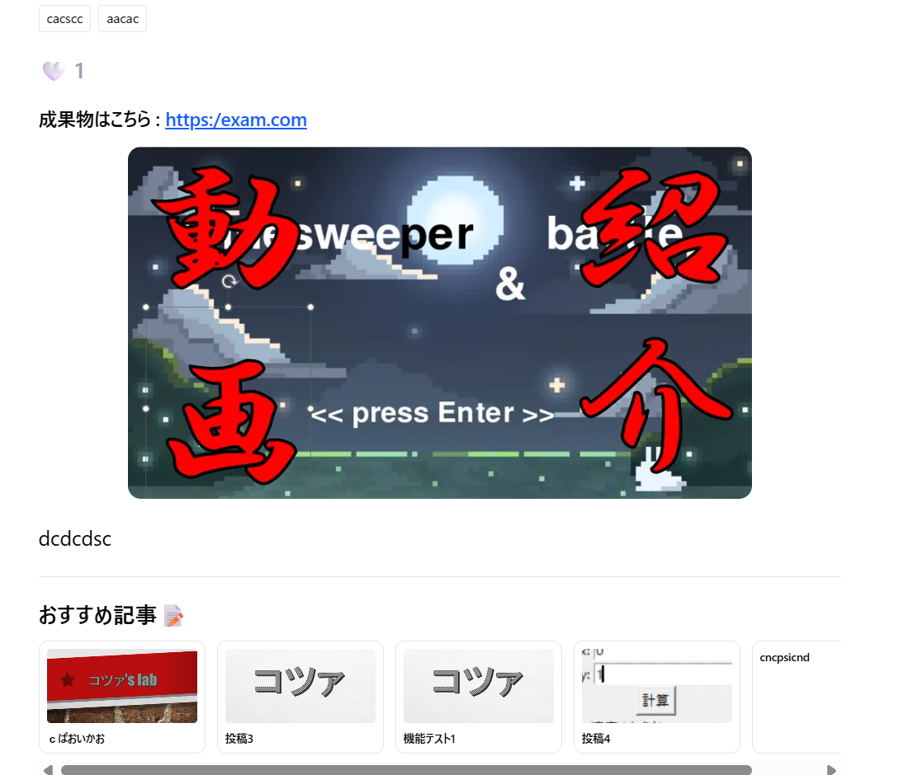 

- 管理投稿記事一覧ページ 
このページでは投稿記事の一覧に加えて、削除や編集ページへの遷移などもできます。 
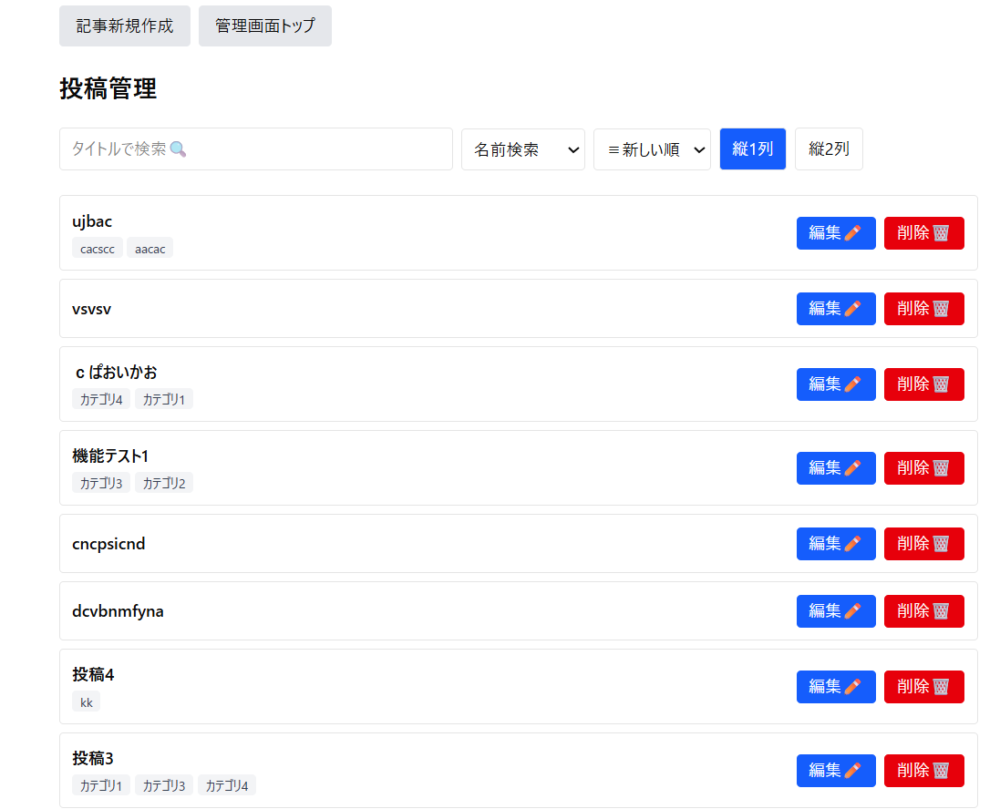 
- 投稿記事新規作成ページ 
このページでは新たに記事を作成することができます。 
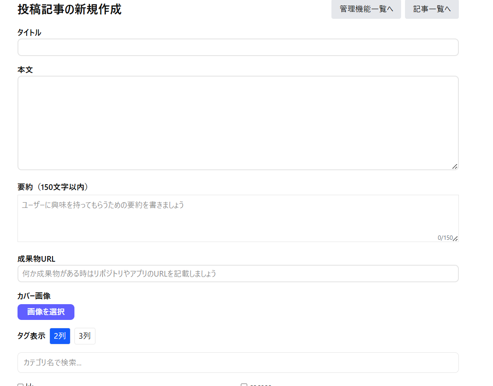 
- 記事編集ページ 
このページでは既存記事の編集をすることができます。 
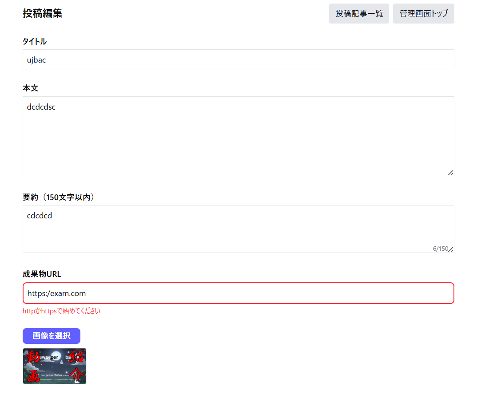 
- 管理カテゴリページ 
このページではカテゴリを一覧で確認することが可能で、直接削除や編集ページへの遷移が可能です。 
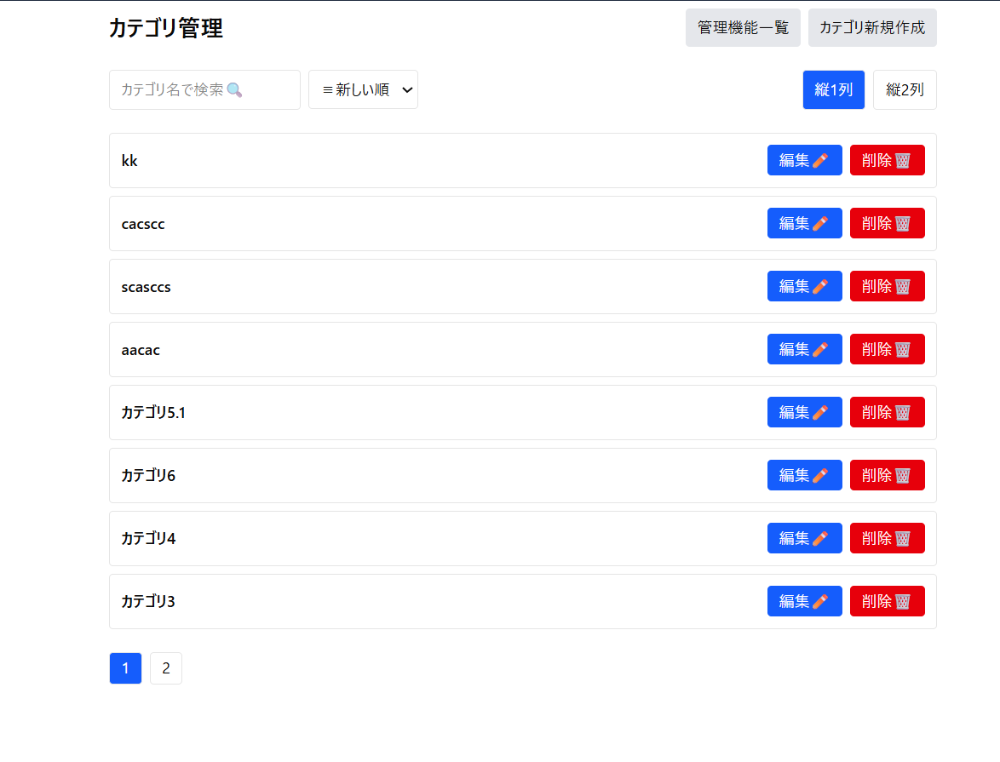 
- カテゴリ新規作成ページ 
このページでは新たにカテゴリを作成することが可能です。 
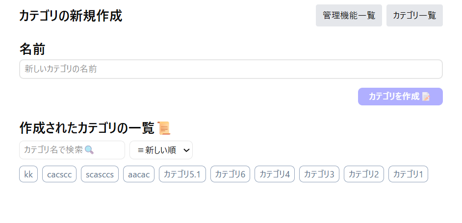 
- カテゴリ編集ページ 
このページでは既存のカテゴリの編集をすることができます。 
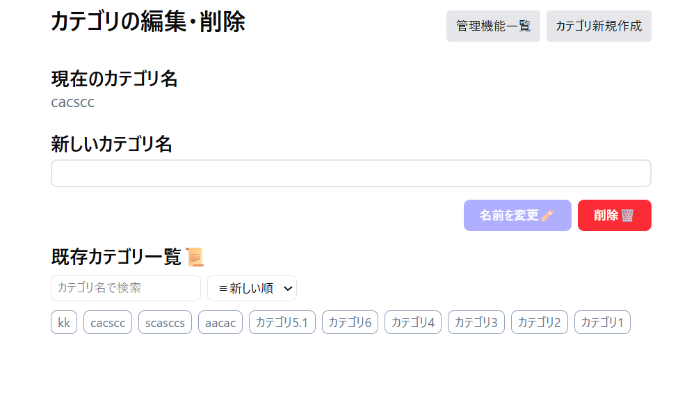 
- 管理機能一覧ページ 
このページでは記事やカテゴリの新規作成、管理用一覧ページ、目安箱のページなど主要な管理用ページにURL入力不要で遷移することができます。 
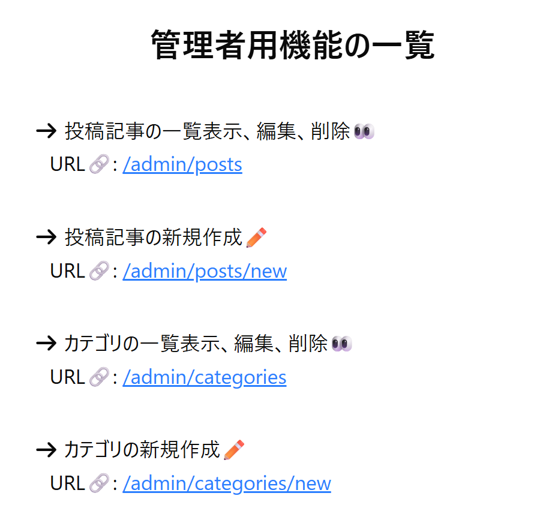 
- ヘッダー 
ヘッダーはどのページを閲覧していても利用したいページだと考えられる
サイトの説明ページやログインページ、トップページ(閲覧用記事一覧ページ)に遷移することができる。また、目安箱はこのサイトに対する感想や意見などをタイトルと本文に分けて書き、送信することができます。 
 感想、意見にも禁則ワードを指定することによって不適切な発言を防ぎました。 
 
-----------------------------------
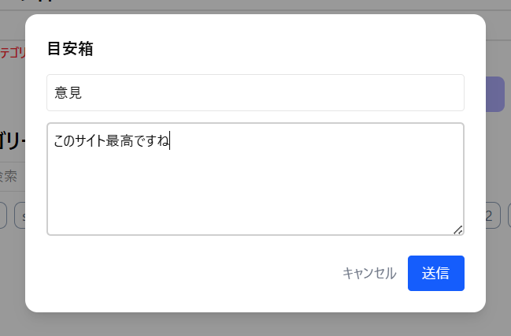 
- サイト説明ページ 
このページはこのサイトや製作者である私について説明するページです。 
私の自己紹介やこのサイトの簡単な説明、私のXやgithubなどのリンクを記載しています。 
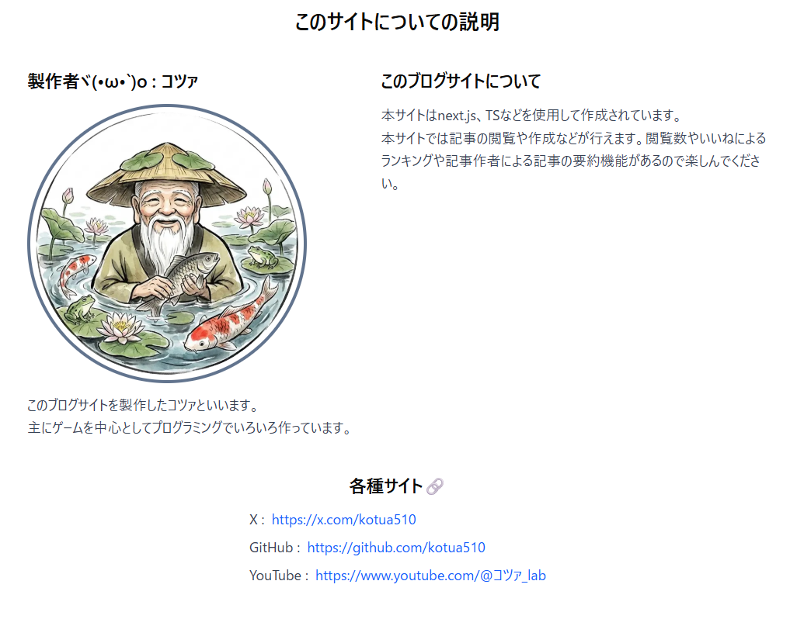 
- 目安箱ページ 
目安箱ページでは送信された意見や感想を管理することができます。 
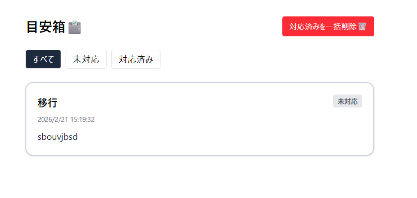 
- ログインページ 
ログインページではメールアドレスとパスワードを用いてログイン、またはメールアドレスとパスワードを用いずにゲストログインを行うことができます 
ゲストログインの場合は編集や新規作成などの一部機能が使用できなくなります。 
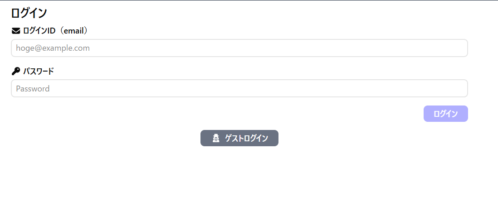 

### 2.機能、特徴についての説明 

- 閲覧用や管理用記事一覧ページの名前、カテゴリ検索機能 
この機能は記事をカテゴリ、もしくは名前で検索することができます。
この検索機能は完全一致ではなく「投稿」と検索したら「投稿1」、「投稿2」が検索できるなど一部の文字が含まれていたら検索できるようにすることで検索のしやすさを向上させました。 
この機能によって特定の記事を探したい時に速やかに記事を発見することができます。また、特定の記事ではなく○○についての記事を探している時などはカテゴリ検索を用いることで速やかに記事を発見できます。 
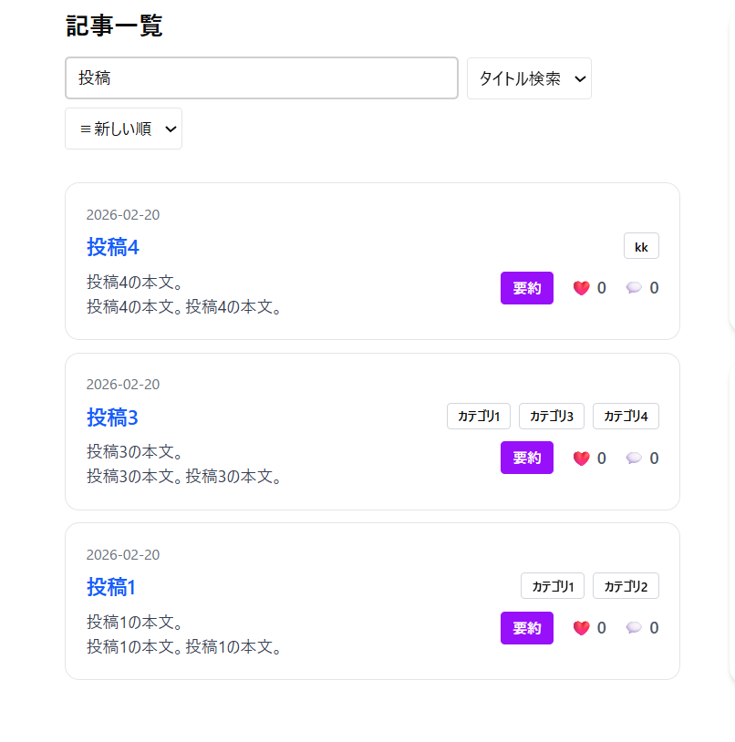 
----------------------------------------------
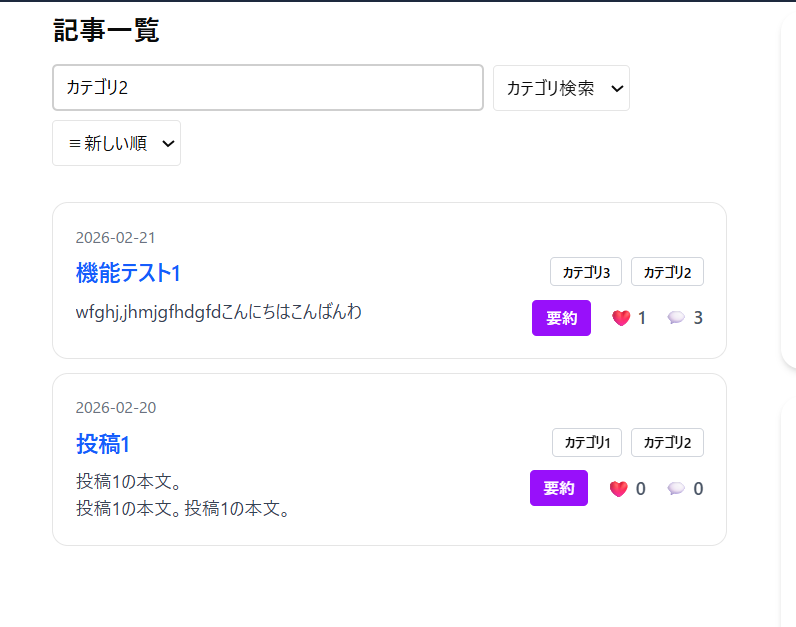 

- 閲覧用や管理用記事一覧ページとカテゴリ一覧、編集、新規作成ページのソート機能 
この機能は記事やカテゴリを新しい順、古い順、タイトル順にソートすることができます。
新しい順、古い順はその名の通り作成された時期によって並び替えます。タイトル順は
カタカナ、数字、英語、ひらがなの順番で並び替えます。 
この機能により探している記事を見つけやすかったり、新たな記事を発見することができます。 
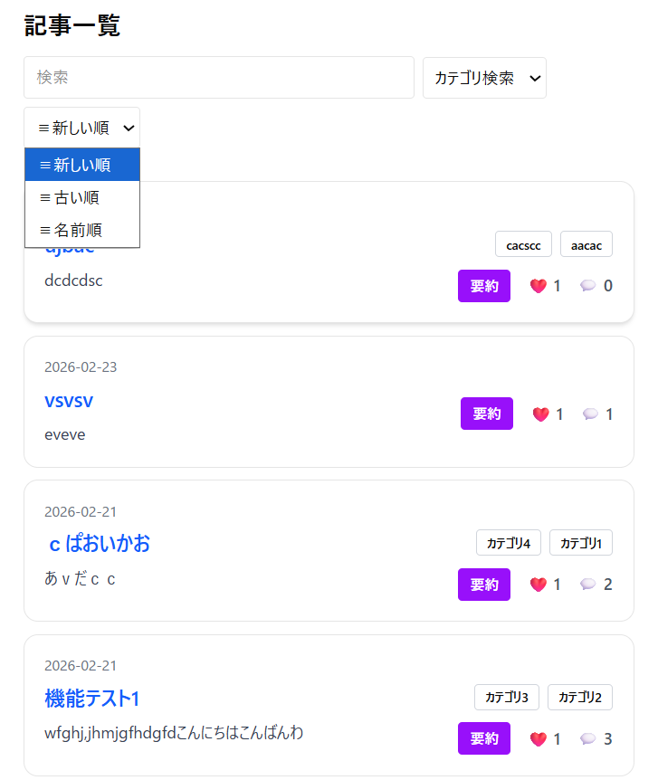 

- 閲覧用の記事一覧ページのいいね、閲覧数ランキング 
いいねや閲覧数などでにランキングを実装しました。
1位は王冠マーク、2,3位は銀色、銅色にすることによって視覚的に順位をわかりやすくしました。また、1位,1位,3位のように同じ順位も実装しました。
ランキングに実際の数値を表示することによってランキングのスケールが分かるようにしました。
さらにランキングを見て検索しなくてもいいようにランキングの記事の名前から直接記事の詳細画面に飛べるようにしました。 
この機能によって満足度の高い記事、注目されている記事を見つけることができます。 
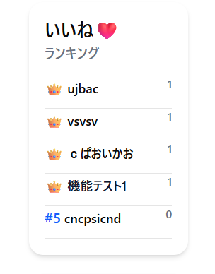
----------------------------------------------
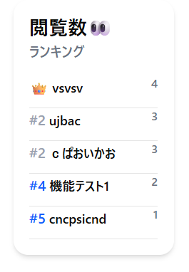 

- 閲覧用記事一覧ページの記事の要約 
記事をすべて読まなくても記事の内容が分かるように要約機能を実装しました。
この要約は記事を作成するときもしくは編集時に作者が設定することができます。
 要約は150文字以内とすることによっては長くなりすぎないようにしました。 
この機能によって1目で大まかに記事を理解することができ、要約を読んで興味を持った結果本文を読みに行くなど記事への導入も行うことができます。 
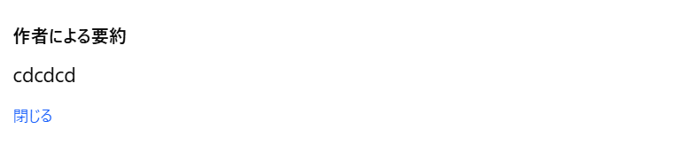 

- 閲覧用記事一覧ページに各記事のいいね数とコメント数を表示 
各記事のいいねやコメント数を表示しました。 
この機能によっていいね数やコメント数を表示することでその記事の注目度などを知ることができ、読む記事を決めやすくすることができます。 また、いいねやコメント数を表示することで記事の作者の達成感などにもつながります。 
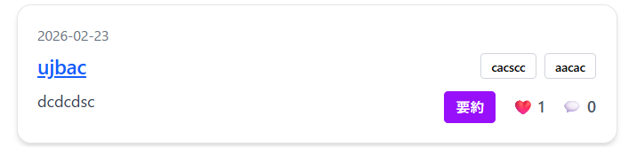 

- 閲覧用や管理用記事一覧ページに各記事のカテゴリを表示 
各記事のカテゴリを表示しました。 
この機能によって内容や要約を読まずともなんとなくどのような記事かをユーザーは知ることができます。 これによってユーザーの興味を引くことができます。 
 

- 閲覧用や管理用記事、カテゴリ一覧ページのページネーション機能 
カテゴリや記事が8個以上になるとページを増やすようにしました。
8の倍数ずつページは増えていき下のボタンでページを切り替えることができます。 
この機能によって記事やカテゴリなどの数が増えてきたときに多くスクロールする必要がなくなります。 また、一ページことに表示する項目を減らすことによってページ自体の見やすさを向上させています。 
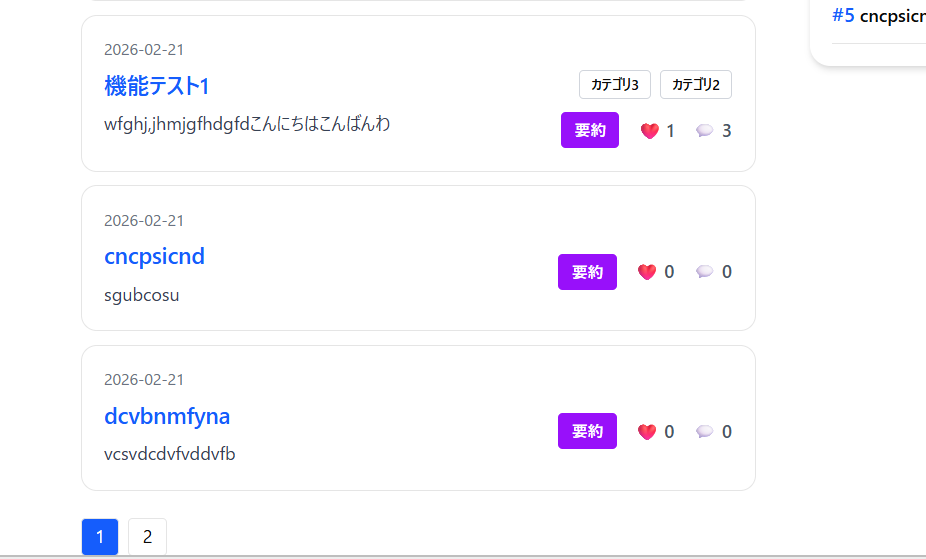 
----------------------------------------------
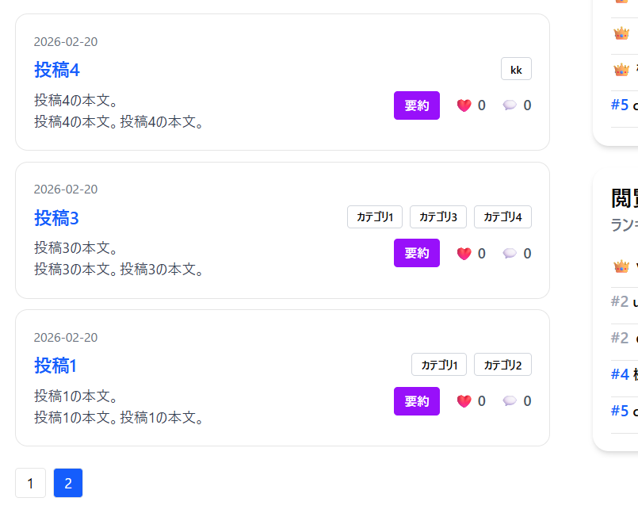 

- 記事詳細ページの記事のいいねやコメントを追加する機能 
いいねは一度クリックするといいねを付与、もう一度押すことでいいねを解除することができます。いいね付与状態ではハートに色が付け視覚的にわかりやすくしています。
コメントは入力欄に入力、送信ボタンをクリックすることで記事にコメントを投稿することができます。 コメントにも同じ方法でいいねを行うことができます。  
いいねによって作者に記事に対する評価を示すことができます。
コメントによって作者はユーザーの反応を知ることができ、感想やフィードバックを得ることができます。 コメントのいいねにより参考になったり役に立ったコメント、評価の高いコメントを知ることができます。 
コメントには禁則文字が設定されていて不適切な発言などはそもそも送信できないようにしました。 これによってコメントによって不快な気持ちになってしまうことを防ぎました。 
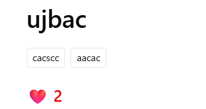 
----------------------------------------------
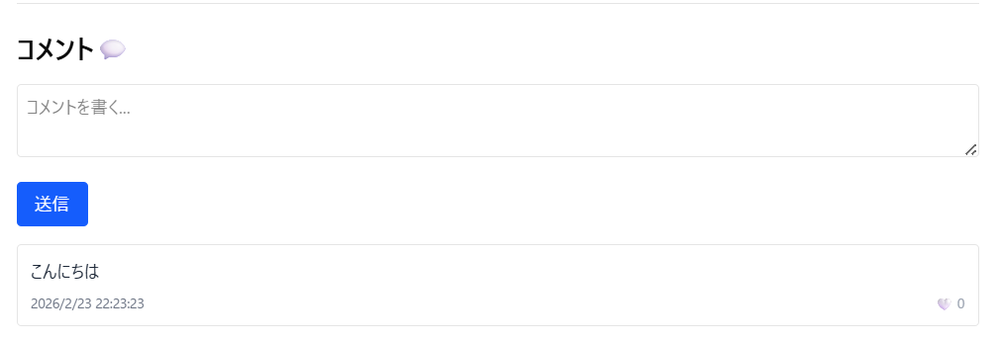 

- 記事の詳細ページに成果物URLを表示 
なにか記事の内容に付随する成果物などがある場合は作者が記事の作成または編集時に設定することで記事詳細ページの上部に成果物のURLを表示することができます。
リポジトリやアプリURLなど自由に設定できます。  この機能によって自分の成果物を直接ユーザーに示すことができます。また、文中に文章としてではなくクリックすることでページ遷移ができるリンクボタンとしてURLを示すことができます。 
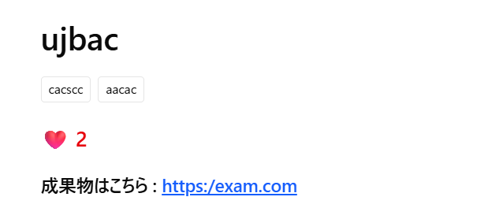 

- 記事詳細ページに画像を表示 
記事詳細ページの上部に画像を表示することができます。 
この機能によってその記事がどんな記事なのかを視覚的に知ることができます。 また、今から読む記事がどんな記事なのかを視覚的に知ることで記事の内容がイメージしやすくなります。 
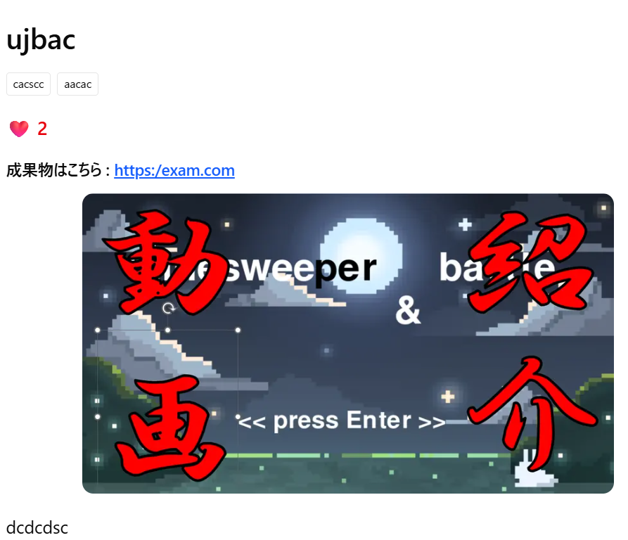 

- 記事詳細ページにおすすめ記事を表示 
その詳細ページの記事と同じカテゴリが含まれている記事を5個表示します。
また、同じカテゴリが含まれている記事が5個未満の場合は投稿されている記事からランダムに補充し、同じカテゴリの数が多ければ多い記事ほど優先して選出されます。 
この機能によってユーザーは興味のある記事を連鎖的に読むことができます。 
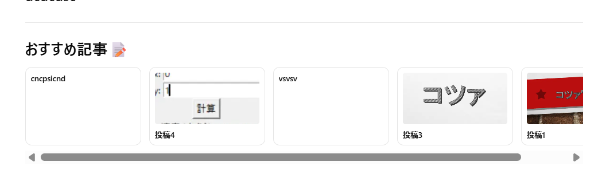 

- 管理用記事一覧ページに記事新規作成、管理機能一覧リンクボタンを実装 
記事新規作成、管理機能一覧リンクボタンそれぞれのボタンをクリックすることでそれぞれのページに飛ぶことができます。 
この機能によって記事の新規作成ページと管理機能がまとめられているページに直接飛ぶことができます。 この二つは記事一覧ページにいるときに行きたいページだと考えたので実装しました。 
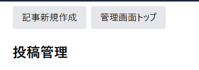 

- 管理用記事一覧、カテゴリ一覧ページに編集、削除ボタンを実装した。 
削除ボタンはその記事やカテゴリを編集画面に入ることなく削除することができます。また、間違いで押してしまったときなどに対応するために本当に消すかの確認を実装しました。
編集ボタンはクリックすることでその記事やカテゴリの編集画面に飛ぶことができます。 
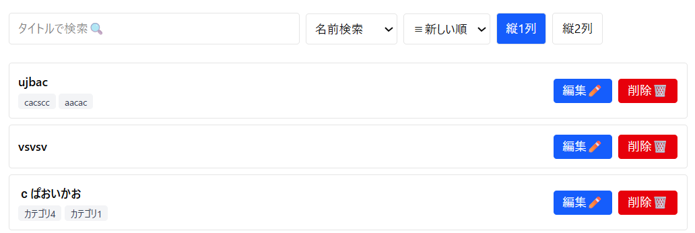 

- 管理用記事一覧、カテゴリ一覧ページの表示方法切り替え機能 
縦1列、縦2列のボタンを押すことで記事一覧、カテゴリ一覧の表示方法を切り替えることができます。 
固定ではなくユーザーが選択できるようにすることでユーザーの好みに合わせて表示方法をカスタマイズすることができます。 
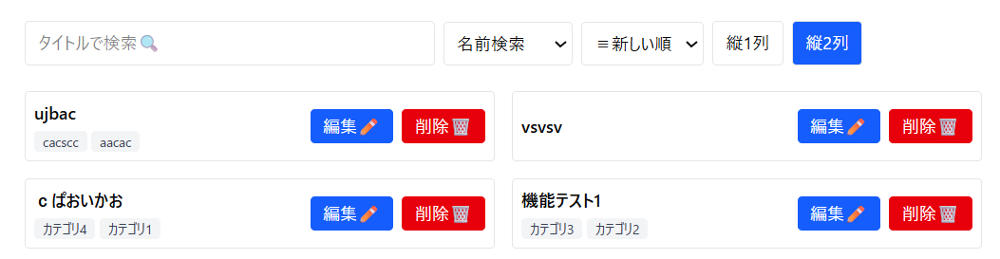 

- 管理用記事新規作成ページと記事編集ページに管理用記事一覧、管理機能一覧リンクボタンを実装 
記事編集、管理機能一覧リンクボタンそれぞれのボタンをクリックすることでそれぞれのページに飛ぶことができます。 
この機能によって記事の編集ページと管理機能がまとめられているページに直接飛ぶことができます。 この二つは事新規作成や編集ページにいるときに行きたいページだと考えたので実装しました。 
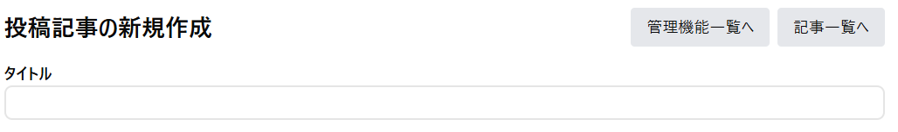 

- 管理用記事新規作成ページと記事編集ページの成果物URL、要約に対して形式などを案内する機能 
要約や成果物URLを入力するときに成果物URLは「http」もしくは「https」の形式である必要があることを表示し、要約は文字数を右下に表示します。 
この機能によって要約はあと何文字書くことが可能かを知ることができ、構成がしやすくなると考えられます。成果物URLは入力した後に間違いに気づくみたいなことを防ぐことができます。
また、この２つの項目は独自のものなので入力欄にどのようなことを書けばいいかを示しました。 
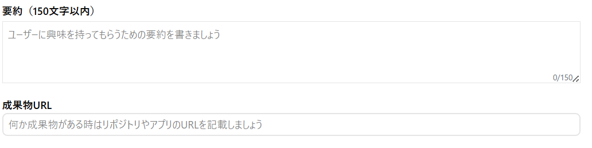 

- 管理用記事新規作成ページと記事編集ページに画像を表示する機能 
記事詳細ページに表示する画像を選択した時、プレビューとして画像を小さく表示します。 
この機能によって画像を選択した時の間違いなどに素早く気づくことができるようになります。 
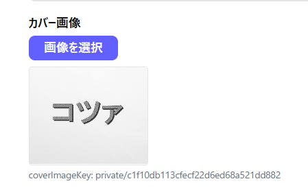 

- 管理用記事新規作成ページと記事編集ページのカテゴリ表示方法を変更する機能 
この機能はカテゴリの上にある2列、3列ボタンによって記事編集、新規作成ページのカテゴリ表示方法を切り替えることができます。 
この機能によって2列か3列ユーザーは好きな表示方法を選択することができます。また、カテゴリ数の増加にも3列で対応することができます。 
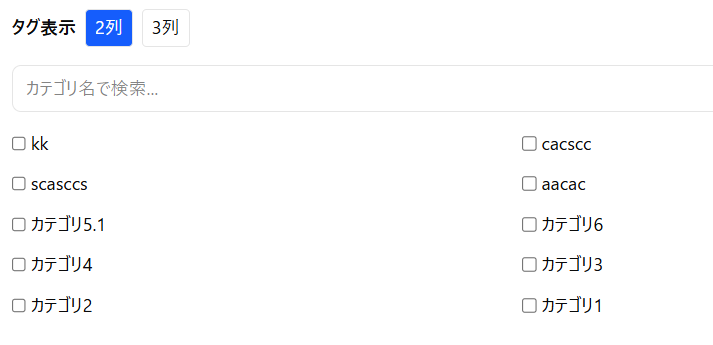 
----------------------------------------------
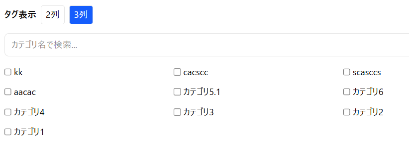 

- 管理用記事新規作成ページと記事編集ページのカテゴリを名前検索する機能 
カテゴリ検索欄によってカテゴリの名前でカテゴリを検索することができます。
この検索機能は完全一致ではなく「カテゴリ」と検索したら「カテゴリ1」、「カテゴリ2」が検索できるなど一部の文字が含まれていたら検索できるようにすることで検索のしやすさを向上させました。 
この機能によってカテゴリ数が増えてきたり、特定のカテゴリを探す時に全体で探すよりも素早く目的のカテゴリを見つけることができます。 
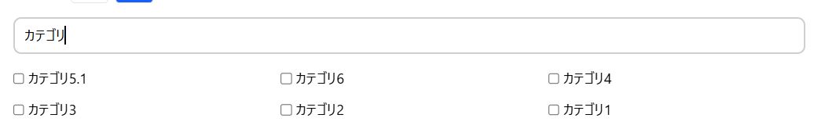 

- 管理用記事編集ページのコメント管理機能 
記事編集ページからその記事についたコメントを削除できるようにしました。 
この機能によって禁則文字などで弾けなかった不適切なコメントを削除することができるようにしました。 
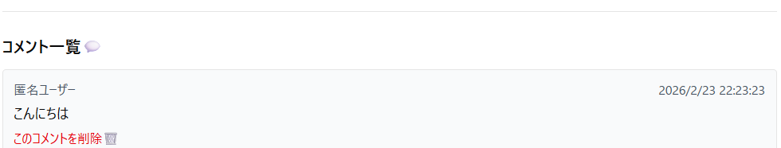 

- 管理用記事編集ページとカテゴリ編集ページの削除機能 
記事、カテゴリ編集ページ下部にある削除ボタンからその記事もしくはカテゴリの削除を行うことができる。
一覧ページからも削除できますが、詳細を見て削除するかどうかを決める場合もあると考えられたので編集ページにも削除ボタンを追加しました。 
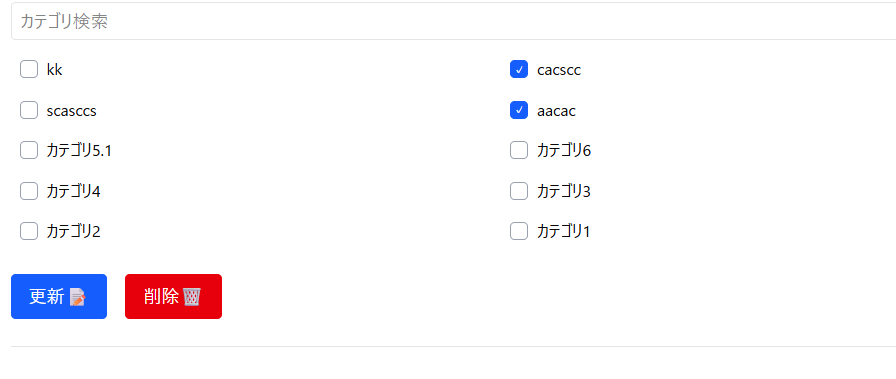 

- 管理用カテゴリ一覧ページ、カテゴリ新規作成ページと編集ページのカテゴリ名前検索機能 
カテゴリ検索欄によってカテゴリの名前でカテゴリを検索することができます。
この検索機能は完全一致ではなく「カテゴリ」と検索したら「カテゴリ1」、「カテゴリ2」が検索できるなど一部の文字が含まれていたら検索できるようにすることで検索のしやすさを向上させました。 
この機能によってカテゴリ数が増えてきたり、特定のカテゴリを探す時に全体で探すよりも素早く目的のカテゴリを見つけることができます。 
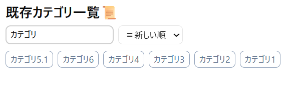 

- カテゴリ新規作成ページと編集ページの名前被り防止機能 
既存のカテゴリと同じ名前を設定しようとしたときそれを知らせ、防止する機能を実装しました。 
この機能によって同じ名前のカテゴリが複数作成されるのを防ぐことができます。 
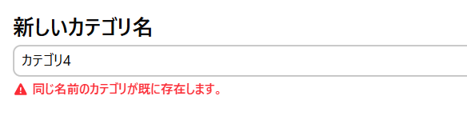 

- カテゴリ新規作成ページと編集ページの既存のカテゴリ一覧表示機能 
カテゴリの新規作成、編集ページに既存カテゴリを一覧で表示する機能を実装しました。 
この機能によって入力する前から同じ名前のカテゴリを作成することを防ぐことができます。
また、ここに表示されているカテゴリをクリックすることでそのカテゴリの編集画面に飛ぶこともできます。 
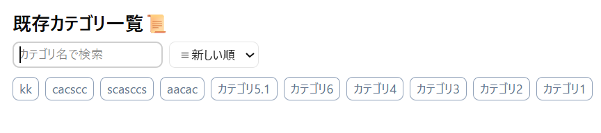 

- 目安箱ページの送信されたものを対応済みかどうかで管理する機能 
送信された意見、感想は対応済みか否かで管理されていて、対応済みもしくは未対応と書かれているところをクリックで状態を変更することができます。 
また、意見、感想は上部の対応済みの一括削除ボタンによって対応済みとなっているものを一括で削除できます。 
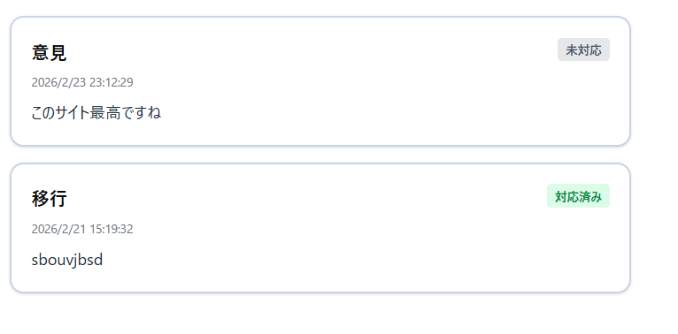 

- 目安箱ページの表示切り替え機能 
上部のボタンによって表示する意見、感想を絞り込むまたは、全てを表示することができる。
意見、感想の状態によって表示を切り替えます。 
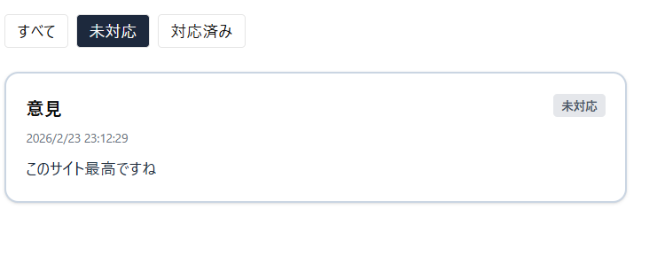 
----------------------------------------------
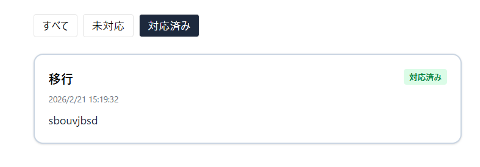 

- ログインページのメールアドレス形式誘導機能 
メールアドレスを入力するときにメールアドレスの形式に沿っていなかった場合知らせます。この機能によってメールアドレスの入力ミスを軽減することができます。 
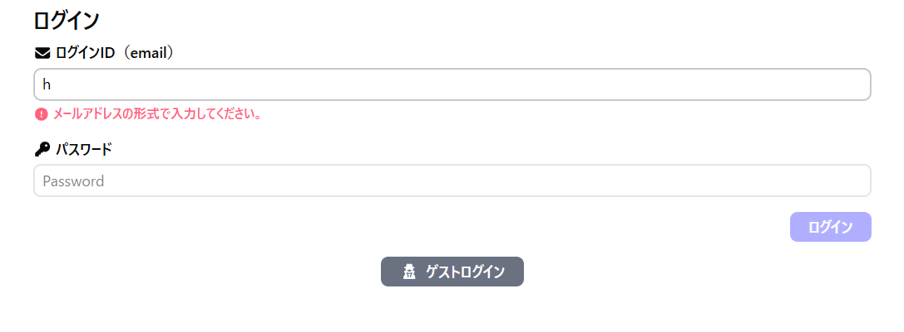 

- ログイン機能 
ログインすることで記事やカテゴリの編集や削除、作成などログイン限定機能の実行が可能となります。 
 

## 使用技術 (技術スタック)

### 1.使用した言語やフレームワーク
- TypeScript
- Next.js
- Prisma

### 2.開発に使用したツールやウェブサービス
- VSCode
- Supabase
- Vercel

## 開発期間・体制

- 開発体制: 個人開発
- 開発期間: 2025.12.11 ~ 2026.02.23 (約105時間)

## 工夫した点

- カテゴリや記事に対して検索やソート機能を実装したこと 
カテゴリや記事に対して検索やソート機能を実装することによって記事やカテゴリを探しやすくなるように工夫しました。 
ただ実装するのではなく複数の条件で検索やソートをできるようにすることによってより高精度に検索やソートを行えるように工夫しました。 
検索やソートを使用することで使用しない時よりも素早く記事を探すことができます。 
 
--------------------------------------------------------
 

- 記事の要約を実装したこと 
記事の要約を実装することによって本文を読まなくても記事の内容を理解することができるように工夫しました。  
実際私の体験談として途中から飽きてしまって記事を読むのをやめてしまったり、思ってた記事と違うかったということもあったのでそういうことを防ぐために要約を実装しました。また、要約を読んで興味があれば本文を読むなど記事を読むこと自体のハードルを下げる目的もあります。 
 

- いいね、閲覧数ランキングを実装したこと 
いいねや閲覧数でランキングを作成することによってサイトが活性化するように工夫しました。 
記事の作者にはランキングに記載されることによる達成感などを提供することができ、ユーザーはランキングから評価の高い記事や閲覧数が多い記事を知ることが可能で、そこから新しい記事の発見などを行うことができます。 これらはサイトの活性化につながると考えます。 

----------------------------------------------
 

- 記事一覧ページにカテゴリを表示したこと 
記事一覧ページにカテゴリを表示することによって記事の要約や本文を読まずとも何となく記事の内容を把握できるように工夫しました。 
これによって開いてみたら思ってた記事と違うかったなどのミスマッチを減らすことができます。 
 

- 記事のいいねやコメントを実装したこと 
記事のいいねやコメントを実装することによって閲覧ユーザーの気持ちや感想などを記事の作者に伝えることができるように工夫しました。 
閲覧ユーザーはいいねやコメントを使用することによって
記事の作者にその記事に対するコメントや感情を伝えることができます。 
 
----------------------------------------------
 

- 記事の成果物URLを実装したこと 
記事の成果物URLを実装したことによって成果物を分かりやすく示すことができるように工夫しました。  
成果物URLの項目を記事の構成内容として追加することで成果物URLの位置を固定し、どの記事でも成果物URLがどこにあるか分かりやすくしました。また、本文に含めるとなると遷移ボタンにはできないが、成果物URLを実装したことでそのURLをクリックしたらそのページに飛べるように工夫しました。 
 

- 記事の画像を実装したこと 
記事の画像を表示することによって視覚的に記事の内容を理解できるように工夫しました。  記事の作者は画像によってユーザーに記事の内容を分かりやすく伝えることができます。逆にユーザーは画像を見て、記事の内容をより深く理解することができます。 
 
- 記事のおすすめ記事を実装したこと 
記事のおすすめ記事を実装したことによって呼んだ記事と似た記事を提示し、ユーザーが興味のありそうな記事を連鎖的に読むことができるように工夫しました。 
また、同じカテゴリの記事が存在しない場合でもランダムに補充することでおすすめの記事がないということにならないように工夫しました。 
 

- 記事やカテゴリのページネーションを実装したこと 
記事やカテゴリのページネーションを実装したことによってユーザーの負担を減らせるように工夫しました。 
記事やカテゴリの数が増えた場合でも、多くスクロールする必要がなくなりユーザーの利便性が向上します。 
 
----------------------------------------------
 

- カテゴリや記事一覧の直接削除を実装したこと 
カテゴリや記事一覧の直接削除を実装したことによっていちいち編集画面に入らなくても記事やカテゴリを削除することができるように工夫しました。 
編集画面から削除する機能も必要だと考えたのですが、一覧画面から削除する機能があるので削除したい記事が複数ある場合は便利です。 
 

- 記事、カテゴリ管理ページの遷移ボタンを実装したこと 
記事、カテゴリ管理ページの遷移ボタンを実装したことによって近い管理機能や管理機能一覧ページにすぐアクセスできるように工夫しました。 
一覧管理、編集ページの時は新規作成、管理機能一覧ページに、新規作成ページの時は一覧管理、管理機能一覧ページに素早くアクセスできることで違う管理機能に素早くアクセスすることができます。 
 
-------------------------------------------
 

- 記事新規作成や編集ページに画像プレビューを実装したこと 
記事新規作成や編集ページに画像プレビューを実装したことによって画像を選択したときの間違いなどに素早く気付けるように工夫しました。 
画像を選択した時にプレビューがあることで視覚的に画像を確認することができ、間違いやイメージしてたものを違うということを変更を反映して記事の詳細画面を見に行かなくても分かるようにしました。 
 

- 記事編集や新規作成ページの成果物URLや要約における入力の手助けを実装したこと 
記事編集や新規作成ページの成果物URLや要約における入力の手助けを実装したことによって成果物URLや要約にどんなことを入力したらよいかユーザーが迷わなくて済むようにしました。 
要約や成果物URLはブログアプリとしてはそこまでメジャーな機能ではないと考えたので、どのようなことを書いたら良いかを示すことでユーザーがどのようなことを書いたら良いか迷うことを軽減しました。 
 

- コメントの禁則文字と記事の編集画面のコメント削除機能を実装したこと 
コメントの禁則文字と記事の編集画面のコメント削除機能を実装したことによってコメントの不適切発言を防ぐように工夫しました。 
コメントによって不快になってしまう人が生まれないようにコメントには禁則文字を設定したのですが、それでもこぼれてしまったコメントも削除できるようにしました。 
 
---------------------------------
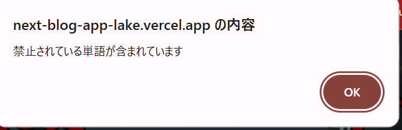 

- カテゴリ新規作成、編集ページで既存カテゴリを一覧で表示したこと 
カテゴリ新規作成、編集ページで既存カテゴリを一覧で表示したことによって同じカテゴリを作成してしまうことを事前に防ぐように工夫しました。 
既存カテゴリを参照することによって事前に名前被りを防止し、ユーザーのストレスを軽減しました。 
 

- 管理一覧ページを実装したこと 
管理一覧ページを実装したことによって主要な管理機能に素早くアクセスすることができるように工夫しました。 
管理一覧ページでは記事やカテゴリの一覧表示、新規作成など主要な管理機能にアクセスできるようにすることで管理する際のユーザーストレスを軽減しました。 
 

- ヘッダーに目安箱を設置したこと 
ヘッダーに目安箱を設置したことによってユーザーの意見を取り入れることができるように工夫しました。 
目安箱に意見を送信することでサイトへの改善要望などをサイト作成者に送ることができます。これによって製作者はユーザーの意見を取り入れこのサイトを改善することができます。 
 
-----------------------------------
 

- 目安箱に送られてきたものを管理できるようにしたこと 
目安箱に送られてきたものを管理できるようにしたことによってサイト管理者は目安箱の内容を確認、対応することができるように工夫しました。 
目安箱の意見は対応済みか未対応かで状態を切り替えることができるので対応した意見は対応済みに変更することで区別をすることができます。 また対応済みの意見は一括で削除することができるので意見がたまりすぎることも防ぐことができます。 
 
----------------------------------------------
 
---------------------------------------------------------
 

- ログイン、ゲストログインを実装したこと 
ログイン、ゲストログインを実装したことによってログイン、ゲストログイン限定の機能を使用できるように工夫しました。 
ログインではURLに「admin」とついた管理者機能を使用することができます。 ゲストログインではログインと比べて編集や新規作成、削除といった機能に制限がかかります。編集や新規作成ページで実際の編集や新規作成を行うことはできますが、その内容を反映することはできません。 
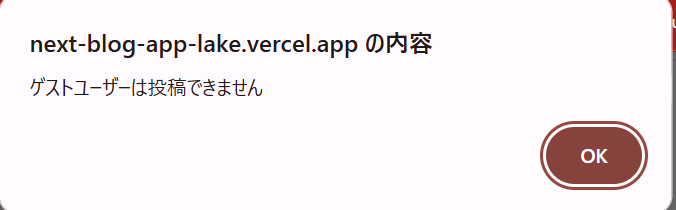 

- アイコンを多く使用したこと 
アイコンを多く使用したことによって視覚的にそれがどんな機能なのかを分かりやすくなるように工夫しました。 
ボタンなどに「✏️」を追加することによってそれがどんな機能かを視覚的に分かりやすくするとともに、キャッチ―な印象をユーザーに与えました。 
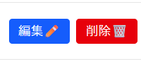 

- レスポンシブデザインにしたこと 
レスポンシブデザインにしたことによってスマホ、PC問わずサイトを利用できるように工夫しました。  
PCでもスマホでもストレスなくこのサイトを利用することができます。 
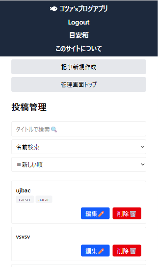 

- いいね、閲覧数を同じ人では増えないようにしたこと 
いいね、閲覧数を同じ人では増えないようにしたことで不正ないいね、閲覧数の増加を防ぐように工夫しました。 
いいねや閲覧数は同じユーザーでは無制限に増やすことはできません。これによってランキングなどの整合性を保っています。 

## 既知の課題と今後の展望

### 1.既知の課題
- ページ間の移動が少々不便なこと 
PCなどではそこまで感じなかったのですがスマホだとページへの移動が特定のページから特定のページにしか移動することができず、不便に感じました。

### 2.今後の展望
- 既知の課題の解決 
すでにある上記の課題を解決します。具体的にはサイドバーやヘッダーにページ一覧表などを作成するつもりです。 
- 要約機能の改善 
現時点では要約は作者が設定しますが、将来的にはAIなどによって自動的に要約することができればよいなと考えています。
現時点では課金などの計画が上手くまとまらなかったので実装を見送りました。 

## 連絡先

- <a href="https://kotua510.github.io/my.portfolio/">作品集ポートフォリオ</a> 
- <a href="https://x.com/kotua510">Xアカウント</a> 
- <a href="https://www.youtube.com/@コツァ_lab">Youtube</a> 